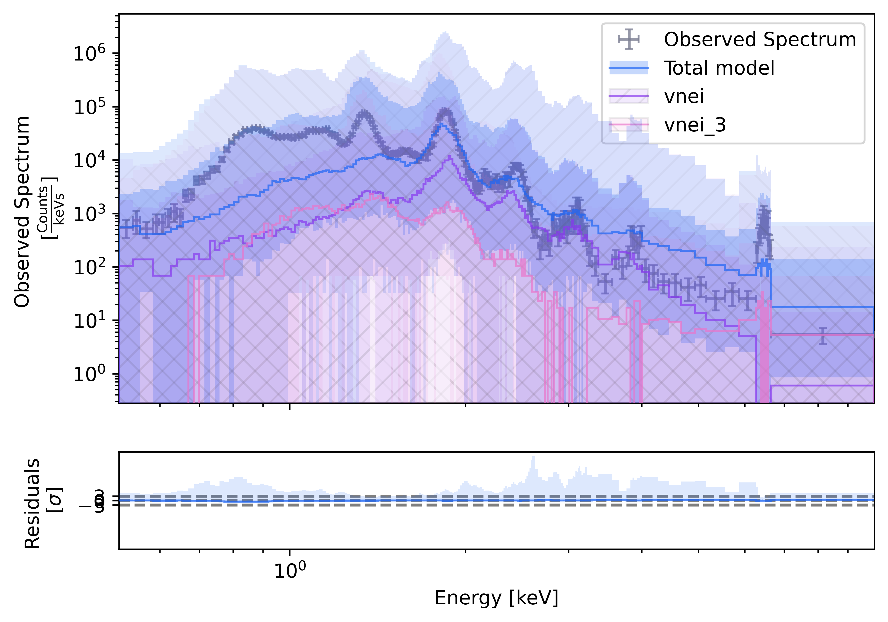
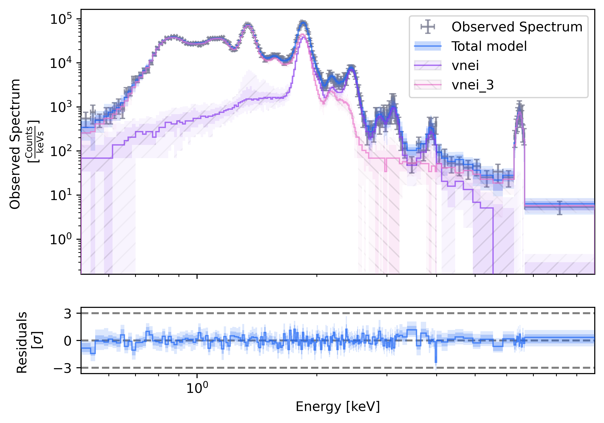

# Simple fit

This page walks through a complete fit that is representative of the Tycho SNR analysis as seen by Chandra/ACIS, from loading OGIP files with `PyXSPEC` to checking the posterior predictive coverage. The snippets are meant to be read in order: each block builds on the objects created in the previous one.

## Data loading with PyXSPEC

Start by importing `PyXSPEC`, clearing any state left from a previous interactive session, and setting the XSPEC options used for this fit.

``` python title="Mandatory imports and clearing"
import os
import xspec

xspec.AllData.clear()
xspec.AllModels.clear()

# Some settings for XSPEC
xspec.Fit.statMethod = "cstat"
xspec.Fit.bayes = "off"
xspec.Xset.xsect = "vern"
xspec.Xset.abund = "lpgs"
```

Next, let's load the source spectrum together with its response files. Once the data are loaded, we ignore the bad channels and restrict the fit to the energy band of interest.

``` python title="Load the data with OGIP files"
xspec_observation = xspec.Spectrum(
    "fakeit_tycho_raw.pha",
    respFile="reg_64_10093.rmf",
    arfFile="reg_64_10093.arf",
)

# Removing bad channels
xspec.AllData.ignore("bad") 

# Set the energy band
low_energy, high_energy = 0.5, 10.
xspec_observation.ignore(f"0.0-{low_energy:.1f} {high_energy:.1f}-**") 
``` 

With the data in place, define the spectral model that will be sampled. Here the absorption component multiplies two `vnei` plasma components, which lets the fit capture multiple thermal populations.

``` python title="Setup the XSPEC model"
xspec.Xset.addModelString("NEIAPECROOT","3.1.3") # Extra model variable
xspec_model = xspec.Model("tbabs*(vnei + vnei)")
xspec_model.show()
```

## Prior distributions

The next block freezes or constrains the `PyXSPEC` parameters and then declares the priors for the parameters that will actually be sampled. Every parameter must be either frozen (by setting its `error` to a negative value) or set to a prior distribution.

``` python title="Define prior distributions"
from bsixsa.priors import uniform, loguniform
from bsixsa.convenience import XSilence

with XSilence():
    
    # We apologize for this heavy syntax, this is directly inherited from pyXSPEC
    
    xspec_model.vnei_3.Redshift.link = xspec_model.vnei.Redshift

    xspec_model.TBabs.nH = '0.7,-1,0,0,9999,9999' 
    # 'value,error,hard_low,soft_low,soft_high,hard_high'
    # Error set to negative value tells XSPEC to keep it frozen during the fit

    xspec_model.vnei.H = '1,-1,0,0,9999,9999'
    xspec_model.vnei.He = '1,-1,0,0,9999,9999'
    xspec_model.vnei.C = '1,-1,0,0,9999,9999'
    xspec_model.vnei.N = '1,-1,0,0,9999,9999'
    xspec_model.vnei.O = '1,-1,0,0,9999,9999'
    xspec_model.vnei.Ne = '1,-1,0,0,9999,9999'
    xspec_model.vnei.Fe = '1,-1,0,0,9999,9999'
    xspec_model.vnei.Ni = '1,-1,0,0,9999,9999'
    xspec_model.vnei.Ca = '1750,-1,0,0,9999,9999'
    xspec_model.vnei.Tau = '4.7e10,-1,0,0,1e11,1e11'
    xspec_model.vnei.Redshift = '0,-1,-1,-1,1,1'
    xspec_model.vnei.norm = '7e-6,-1,0,0,1,1'

    xspec_model.vnei_3.H = '1,-1,0,0,9999,9999'
    xspec_model.vnei_3.He = '1,-1,0,0,9999,9999'
    xspec_model.vnei_3.C = '1,-1,0,0,9999,9999'
    xspec_model.vnei_3.N = '1,-1,0,0,9999,9999'
    xspec_model.vnei_3.O = '1,-1,0,0,9999,9999'
    xspec_model.vnei_3.Ne = '1,-1,0,0,9999,9999'
    xspec_model.vnei_3.Mg = '1000,-1,0,0,9999,9999'
    xspec_model.vnei_3.Si = '1000,-1,0,0,9999,9999'
    xspec_model.vnei_3.S = '1,-1,0,0,9999,9999'
    xspec_model.vnei_3.Ar = '1,-1,0,0,9999,9999'
    xspec_model.vnei_3.Ca = '1,-1,0,0,9999,9999'
    xspec_model.vnei_3.Si = '1000,-1,0,0,9999,9999'

prior = [
    ("vnei_2", "kT", uniform(0.4, 5.)),
    ("vnei_2", "Mg", loguniform(0.1, 500.)),
    ("vnei_2", "Si", loguniform(50., 5_000.)),
    ("vnei_2", "S", loguniform(50., 5_000.)),
    ("vnei_2", "Ar", loguniform(50., 5_000.)),
    ("vnei_2", "Tau", loguniform(5e8, 5e11)),
    ("vnei_2", "Redshift", uniform(-6e-2, +6e-2)),
    ("vnei_2", "norm", loguniform(1e-7, 1e-3)),
    ("vnei_3", "kT", uniform(5., 20.)),
    ("vnei_3", "Fe", loguniform(50., 5_000.)),
    ("vnei_3", "Tau", loguniform(5e8, 5e11)),
    ("vnei_3", "norm", loguniform(1e-8, 1e-4)),
]
```

## Solver

Once the priors are ready, instantiate the solver. This object coordinates everything needed to run the inference, and the backend is inferred from the [`BackendConfig`][bsixsa.backend.BackendConfig] passed at construction time.

``` python title="Define the solver"
from bsixsa import Solver, Nautilus

solver = Solver(
    prior,
    outputfiles_basename="result/",
    overwrite=True,
    backend=Nautilus(num_live_points=2_000),
)
```

Before launching the fit, it is essential to check whether the prior alone generates spectra that are compatible with the observed counts. Large mismatches here often indicate that a bound or model assumption should be revisited.

``` python title="Prior predictive check"
solver.plot_predictive_coverage("prior", min_counts=10, residual_kind="sigma", figsize=(7,5));
```

{ width="600"}
/// caption
Prior predictive coverage for the configured model and priors.
///

As the prior predictive check looks reasonable, we run the sampler. 

``` python title="Run the solver"
fit_result = solver.run()
```

After sampling, compare posterior predictive spectra with the data. This is the quickest visual check that the fitted model explains the observed counts and residual structure.

``` python title="Posterior predictive check"
solver.plot_predictive_coverage("posterior", min_counts=10, residual_kind="sigma", figsize=(7,5));
```

{ width="600"}
/// caption
Posterior predictive coverage after running the nested sampler.
///
