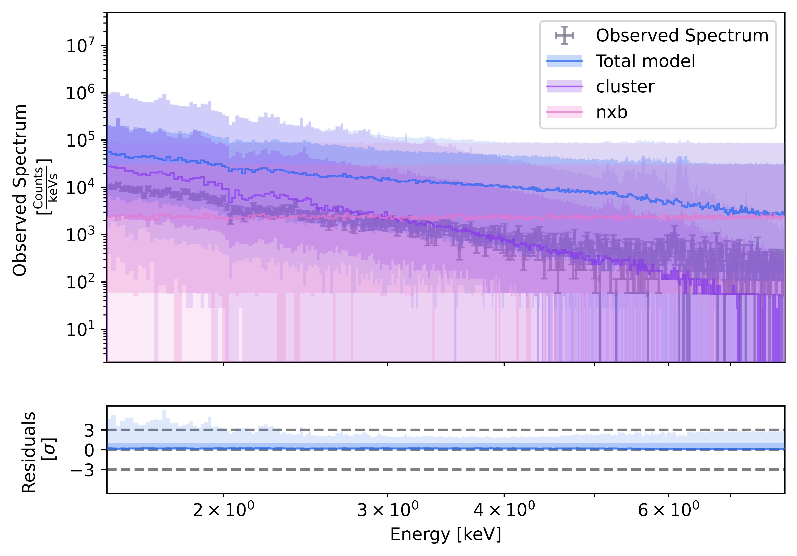
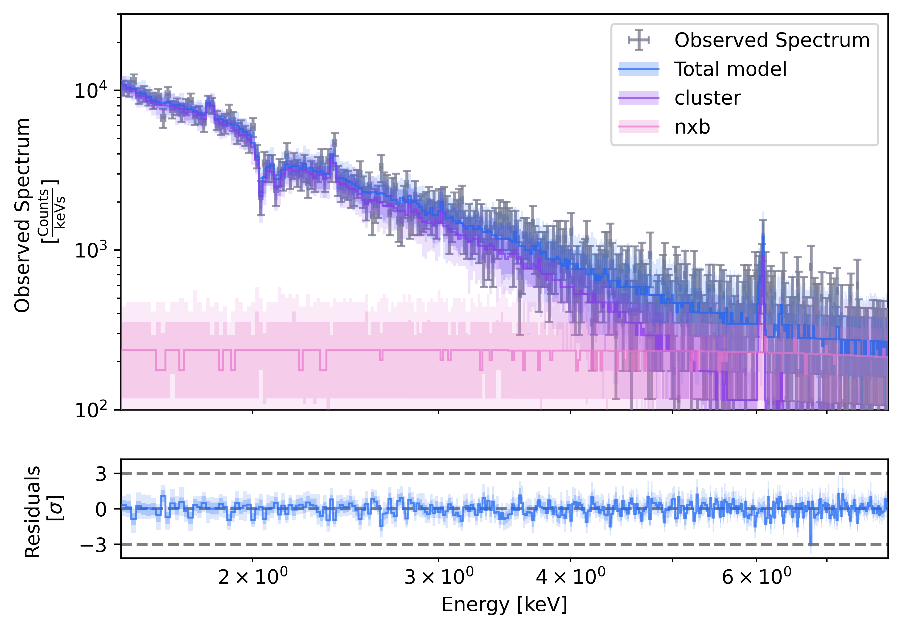

# Including `NXB` with multi-response

Including the contribution of `NXB` is easy to do using the [`multiresponse`](https://heasarc.gsfc.nasa.gov/docs/software/xspec/python/html/spectrum.html) interface of `PyXSPEC`. We explore this using a mock X-IFU observation of a galaxy cluster.

## Data loading with PyXSPEC

Let's first load the data and define our observational configuration.

``` python title="Mandatory imports and data loading"
import os
import xspec

xspec.AllData.clear()
xspec.AllModels.clear()

# Some settings for XSPEC
xspec.Fit.statMethod = "cstat"
xspec.Fit.bayes = "off"
xspec.Xset.xsect = "vern"
xspec.Xset.abund = "wilm"

xspec_observation = xspec.Spectrum(
    "fakeit_A85.pha",
    respFile="ABELL85_CORE_60k_60k_Hp_allpix_L.rmf"
    arfFile="xa201099010rsl_p0px1000_ptsrc.arf"
)

# Removing bad channels
xspec.AllData.ignore("bad") 

# Set the energy band
low_energy, high_energy = 1.5, 8.
xspec_observation.ignore(f"0.0-{low_energy:.1f} {high_energy:.1f}-**")
``` 

## Models

Now, we define the model for the cluster as a simple absorbed and broadened APEC model.

``` python title="Mandatory imports and data loading"
cluster_model = xspec.Model("tbabs*bapec", sourceNum = 1, modName = 'cluster')
cluster_model.show()
``` 

Now, we can define the multi-response for the NXB. As the NXB is contributed by the instrument solely, it doesn't go through the effective area. Hence, we define the multi-response as follows.

``` python title="Multi-response and NXB model setting"
xspec_observation.multiresponse[1] = xspec_observation.multiresponse[0].rmf
nxb_model = xspec.Model("pow", sourceNum = 2, modName = 'nxb', setPars={1:0,2:1e-5})
nxb_model.show()
```

## Prior distributions 

Now, there are subtle differences when interacting with a multi-model and a single model. For instance, we have to explicitly state which model correspond to which parameter. In particular, note that the prior tuple are in the form `(modelName, componentName, parameterName, distribution)` instead of `(componentName, parameterName, distribution)`.

``` python title="Define prior distributions"
from bsixsa.priors import uniform, loguniform

xspec.AllModels(1, modName="cluster").TBabs.nH = "0.01, -1, 0, 0, 1, 1"
xspec.AllModels(1, modName="nxb").powerlaw.PhoIndex = "0., -1, 0, 0, 1, 1"

prior = [
    ("cluster", "bapec", "kT", uniform(0, 7)),
    ("cluster", "bapec", "Abundanc", uniform(0, 4)),
    ("cluster", "bapec", "Redshift", uniform(0.05, 0.3)),
    ("cluster", "bapec", "Velocity", uniform(0.5, 1000)),
    ("cluster", "bapec", "norm", loguniform(1e-5, 1e-2)),
    ("nxb", "powerlaw", "norm", loguniform(1e-4, 1e0)),
]
```

## Solver 

Once this is set, we can fit the data.

```
from bsixsa.solver import SIXSASolver
from bsixsa import Nessai

solver = SIXSASolver(
    prior,
    outputfiles_basename="result_nessai_nxb/",
    overwrite=True,
    backend=Nessai()
)
```

As in the other fits, we should first check if the priors are properly chosen. 

``` python title="Prior predictive check"
solver.plot_predictive_coverage(
    "prior", 
    residual_kind="sigma", 
    grouping=30, 
    figsize=(7,5), 
    y_lim=(2, 5e7)
);
```

{ width="600"}
/// caption
Prior predictive coverage for the configured model and priors.
///

Let's run the sampler.

``` python title="Run the solver"
fit_result = solver.run()
```

Now, the fit should be good! Let's check the posterior predictive.

``` python title="Posterior predictive check"
solver.plot_predictive_coverage(
    "posterior", 
    residual_kind="sigma", 
    grouping=30, 
    figsize=(7,5), 
    y_lim=(1e2, 3e4)
);
```

{ width="600"}
/// caption
Posterior predictive coverage after running the nested sampler.
///
