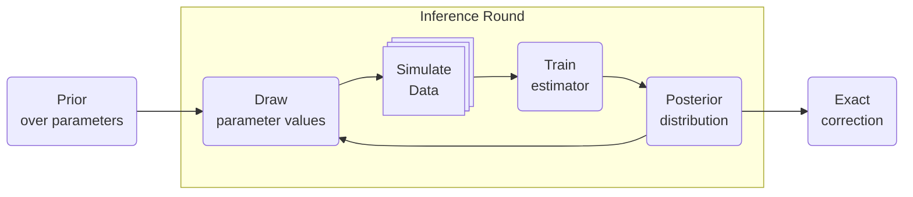

# (B)SIXSA's inner working

## X-ray spectral fitting in a nutshell

An observed X-ray spectrum is a set of counts per detector channel, typically modeled as Poisson draws from a forward model convolved with the instrument response and augmented by background.
To perform a fit, the following ingredients are required :

* **Source model**: photon flux density \( S(E,\theta) \) [ph s\(^{-1}\) cm\(^{-2}\) keV\(^{-1}\)] parameterized by physical quantities \( \theta \) (e.g., temperature, photon index, column density, line energies, abundances).
* **ARF** \(A(E)\): effective area [cm\(^2\)].
* **RMF** \(R(i, E)\): redistribution from true energy \(E\) to channel \(i\).
* **Exposure** \(T\) [s].
* **Background** \(b_i\) expected background counts (from background regions/models).

The predicted counts in channel (i) are

$$
\mu_i(\theta) = T \int R(i, E)\, A(E) \, S(E, \theta)\, \mathrm{d}E + b_i
$$

The counts data \(C_i\) in channel \(i\) are modeled as independent Poisson sampled data.

$$
C_i \sim \mathrm{Poisson}\left\{\mu_i(\theta)\right\}
$$

Classical fitting maximizes (or samples) the Poisson likelihood or equivalent (e.g. `C-stat`).

## What is Simulation-Based Inference (SBI)?

**SBI** train a neural network to approximate a likelihood function in the case where simulating the observable is feasible. We can sample from the data-generating process given parameters:

$$
\theta \sim p(\theta), \quad x \sim p(x \mid \theta)
$$

where \(x\) is the data. SBI replaces an explicit likelihood by learned surrogates trained on simulated pairs \((\theta, x)\).
Doing X-ray spectral fitting, an observed count spectrum can be simulated using 

$$
\mathbf{C} \sim \mathrm{Poisson}\left\{\boldsymbol{\mu}(\theta)\right\}
$$

Many SBI flavors exist, but `(B)SIXSA` focuses on Neural Posterior Estimation (NPE), where we train a conditional density estimator \(q_\phi(\theta \mid x)\) directly, then evaluate at \(x_\mathrm{obs}\) to approximate \(p(\theta \mid x_\mathrm{obs})\). Working with an approximation is much faster and requires less likelihood evaluation than classic approaches to get to the same posterior distribution quality.

## Why a **multi-round** approach?

A single amortized training pass over prior-drawn simulations can be data-hungry and waste simulations far from the posterior mass. Multi-round SBI focuses simulation effort near the parameters that explain the observed data.

### High-level loop

1. Sample \(\theta^{(k)} \sim p(\theta)\), simulate \(x^{(k)} \sim p(x\mid \theta^{(k)})\), train the estimator
2. Use the current estimator at the observed data \(x_\mathrm{obs}\) to define a proposal \(q_r(\theta)\) that concentrates near plausible \(\theta\) (e.g., draw from \(q_\phi(\theta \mid x_\mathrm{obs})\)).
3. Sample \(\theta^{(k)} \sim q_r(\theta)\), simulate \(x^{(k)} \sim p(x\mid \theta^{(k)})\), train the estimator
4. Repeat until satisfying convergence

## Data compression

X-ray spectra can have hundreds to thousands of channels. Training neural estimators directly on raw counts is possible but can be unreliable. Since SBI can learn the likelihood function, it can be fed with any meaningful representation of the data. In particular, compression of the spectra to informative **summary statistics** makes SBI more efficient and robust.
